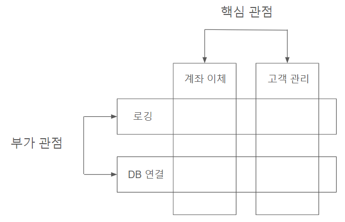

# 02장 스프링 부트 3 시작하기<br>
## 2.1 스프링과 스프링 부트<br>
- 스프링 프레임워크<br>
엔터프라이즈 애플리케이션을 위한 개발 환경
- 스프링 부트<br>
스프링 프레임워크를 더 쉽고 빠르게 이용할 수 있도록 만들어주는 도구

|  | 스프링 | 스프링 부트 |
|---|---|---|
| 목적 | 엔터프라이즈 애플리케이션 개발을 쉽게 | 스프링을 더 쉽게 |
| 개발 환경 설정 | 수동 구성 | 자동 구성 |
| XML | 일부 파일은 XML로 직접 생성, 관리 | X |
| 인메모리 데이터베이스 지원 | X | 자동 설정 지원 |
| WAS | 수동 설정 | 내장형 서버를 제공해 별도의 설정이 필요 없음 |
### 2.1.1 제어 역전 IoC<br>
Inversion of Control<br>
객체를 직접 생성, 제어하지 않고 외부에서 관리하는 객체를 가져와 사용한다. 스프링은 스프링 컨테이너가 객체를 관리, 제공하는 역할을 한다.
```
public class A {
    private B b;
}
```
코드에서 객체를 생성하지 않고 외부(스프링 컨테이너)에서 받아온 객체 B를 b에 할당한다.
<br>
### 2.1.2 의존성 주입 DI<br>
Dependency Injection<br>
제어 역전을 구현하기 위해 사용하는 방법이다.
```
public class A {
    @Autowired
    B b;
}
```
@Autowired 애너테이션으로 스프링 컨테이너에 있는 객체 B(빈)를 클래스 A에 주입한다.
<br>
### 2.1.3 빈과 스프링 컨테이너<br>
- 스프링 컨테이너<br>
빈이 생성되고 소멸되기까지의 생명주기를 관리하는 곳
- 빈<br>
스프링 컨테이너에 의해 관리되는 객체
### 2.1.4 관점 지향 프로그래밍 AOP<br>
Aspect Oriented Programming<br>
프로그래밍에 대한 관점을 핵심 관점, 부가 관점으로 나누어서 관심 기준으로 모듈화하는 것이다. 이를 통해 새발자는 핵심 관점 코드에만 집중할 수 있다.

### 2.1.5 이식 가능한 서비스 추상화 PSA<br>
Portable Service Abstraction
<br>
어떤 서비스에 접근할 때 서비스 종류에 상관 없이 일관된 방식을 유지하는 것이다.
<br>
예를 들면 WAS를 톰캣, 언더토우, 네티 등 이 중 어떤 것을 선택하더라도 기존 코드를 수정하지 않고 그대로 사용할 수 있는 것이다.
<br>
이러한 서비스 추상화 통해 기존 코드를 유지하거나 최소한의 변경을 가하는 것 만으로도 변경되는 기술, 요구사항에 맞춰 유연하게 대처할 수 있다.

## 2.2 스프링 부트 3의 특징 - 자바 17의 주요 변화<br>
스프링 부트 2는 자바 8 버전 이상을 사용했지만 스프링 부트 3은 자바 17버전 이상을 사용해야 한다.
<br>
자바 17의 주요 변화에 대해 살펴보자.
<br>
- 텍스트 블록
```
//이전 버전 : \n
//17버전 : """
//여러줄의 텍스트를 작성할 때 """로 감싸 표현할 수 있다.
```
- formatted()<br>
값을 파싱하기 위한 메서드를 제공한다.
<br>
- 레코드<br>
데이터 전달 목적 객체를 더 빠르고 간편하게 만들 수 있다.
상속이 불가하며 파라미터에 정의한 필드는 private final로 정의된다. 또한 getter를 자동으로 만들기 때문에 따로 정의하지 않아도 된다.
```
record Person(String name, int age){
    // private final로 정의됨
}
Person john = new("john", 20);
john.age(); // 20
```
- 패턴 매칭<br>
타입을 확인하기 위한 instanceof 키워드를 더 쉽게 사용할 수 있다.<br>이전에는 형변환 코드를 조합해야 했지만 바로 형변환을 한 다음 사용할 수 있게 되었다.
<br>
- 자료형에 맞는 케이스 처리
<br>
switch-case문으로 자료형에 맞게 case처리가 가능하다.
<br>
- Servlet, JPA의 네임 스페이스가 Jakarta로 대체
<br>
패키지 네임 스페이스가 javax.*에서 jakarta.*로 변경됨.
<br>
- GraalVM 기반의 스프링 네이티브 공식 지원
<br>
스프링 부트 3부터 GraalVM 네이티브 이미지를 공식 지원하여 기존에 사용하던 자바 가상 머신에 비해 가동 시간이 짧아지고 메모리를 더 적게 소모합니다.
<br>

## 2.3 스프링 부트 3 코드 이해하기
### @SpringBootApplication<br>
스프링 부트의 핵심 애너테이션으로 스프링 부트 사용에 필요한 기본 설정을 해줍니다. 이 애너테이션을 구성하는 애너테이션들 중 스프링 부트의 특징을 나타내는 세 가지는 다음과 같습니다.

- @SpringBootConfiguration<br>
스프링 부트 관련 설정을 나타내는 애너테이션으로 @Configuration을 상속합니다.
- @ComponentScan<br>
사용자가 등록한 빈을 읽고 등록하는 애너테이션입니다.<br>
@Component라는 애너테이션을 가진 클래스들을 찾아 빈으로 등록하는 역할을 랍니다. 단, 빈의 용도에 따라 애너테이션명이 달라집니다.<br>
@Configuration : 설정 파일 등록<br>
@Repository : ORM 매핑<br>
@Controller, @RestController : 라우터<br>
@Service : 비즈니스 로직<br>
위 애너테이션들은 모두 @Component를 갖고 있습니다.
- @EnableAutoConfiguration<br>
스프링 부트에서 자동 구성을 활성화 하는 애너테이션입니다. 스프링 부트가 실행될 때 메타 파일을 읽고 정의된 설정들로 자동 구성합니다.

### @RestController
HTTP 요청과 메서드를 연결하는 라우터 역할을 하는 애너테이션<br>
@Controller와 @Responsbody이 합쳐진 애너테이션으로 이 중 @Controller가 @Component를 갖고 있기 때문에 빈으로 등록됩니다.
