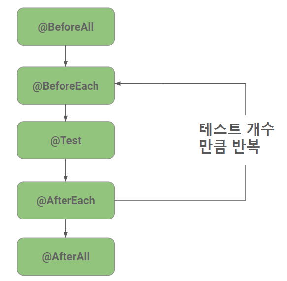
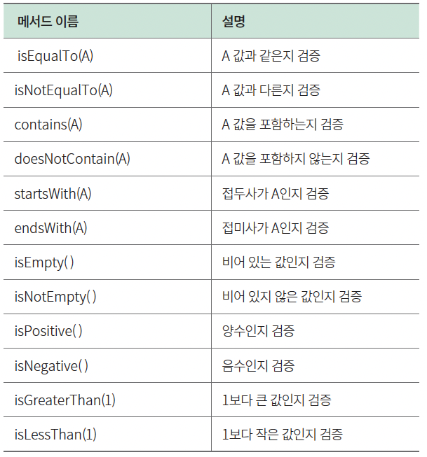

# 4장. 스프링 부트 3와 테스트

## 4.1 테스트 코드 개념 익히기
### 4.1.1 테스트 코드란?
테스트 코드는 작성한 코드가 의도대로 잘 동작하고 예상치 못한 문제가 없는지 확인할 목적으로 작성하는 코드를 말합니다.
### 테스트 코드는 왜 중요한가?
- 소프트웨어 개발의 핵심 과정 중 하나로, 코드의 안정성, 기능성, 성능을 검증하는 데 필수적이다.
- 소프트웨어 개발 과정에서 버그나 오류를 미리 찾아내어 사용자에게 안정적인 서비스를 제공할 수 있다.
- 테스팅을 생략할 시, 예상치 못한 버그나 오류가 발생할 확률이 높아진다.
### given-when-then 패턴
테스트 코드에도 다양한 패턴이 있습니다. 우리는 그중 테스트 코드를 세 단계로 구분해 작성하는 방식인 given-when-then 패턴을 다룹니다.
- given: 테스트 실행을 준비하는 단계
- when: 테스트를 진행하는 단계
- then: 테스트 결과를 검증하는 단계
```java
class CalculatorTest {
    @DisplayName("더하기 테스트")
    @Test
    public void addTest() {
        // given : 더하기를 진행하기 위한 준비 과정
        int a = 1;
        int b = 2;
        Calculator cal = new Calculator();

        // when : a랑 b를 더함
        int sum = cal.add(a,b);

        // then : 더하기가 잘 되었는지 검증
        assertThat(a+b).isEqualTo(sum);
    }

}
```
## 4.2 스프링 부트 3와 테스트
### 스프링부트 테스트를 위한 도구
스프링부트는 애플리케이션을 테스트하기 위한 도구와 애너테이션을 제공합니다. 
테스트를 위한 spring-boot-starter-test 스타터에 다음과 같은 라이브러리들이 포함됩니다.
- JUnit: 자바 프로그래밍 언어용 단위 테스트 프레임워크
- Spring Test & Spring Boot Test: 스프링 부트 애플리케이션을 위한 통합 테스트 지원
- AssertJ: 유연한 검증 라이브러리
- Hamcrest: 표현식을 이해하기 쉽게 만드는 데 사용되는 Matcher 라이브러리
- Mockito: 테스트를 위해 가짜 객체인 목 객체를 쉽게 만들고, 관리하고, 검증할 수 있게 지원하는 테스트 프레임워크
- JSONassert: JSON 검증을 위한 라이브러리
- JsonPath: JSON 데이터에서 특정 데이터를 선택하고 검색하기 위한 라이브러리

### 4.2.1 JUnit이란?
JUnit은 Java 언어를 위한 대표적인 단위 테스트 프레임워크입니다. JUnit 5가 최신 버전입니다.<br>
(JUnit 5는 테스트 클래스와 메소드는 반드시 public을 해야했던 JUnit4와 달리 접근제어자를 모두 사용할 수 있다.)
```java
public class JUnitTest {
    @DisplayName("더하기 테스트")
    @Test
    public void addTest() {
        int a = 1;
        int b = 2;
        int sum = a+b;
    Assertions.assertEquals(sum, a + b); 
    }
}
```
- @DisplayName<br>
테스트 이름을 명시합니다. 
- @Test<br>
독립적으로 테스트를 수행할 메소드를 지정합니다.
- JUnit에서 제공하는 검증 메서드인 assertEquals( )로 a + b와 sum의 값이 같은지 확인합니다. 
```java
public class JUnitTest {
    @BeforeAll // 전체 테스트를 시작하기 전에 1회 실행하므로 메서드는 static으로 선언
    static void beforeAll() {
    System.out.println("@BeforeAll");
    }
    @BeforeEach // 테스트 케이스를 시작하기 전마다 실행
    public void beforeEach() {
        System.out.println("@BeforeEach");
    }
    @Test
    public void test1() {
        System.out.println("test1");
    }
    @Test
    public void test2() {
        System.out.println("test2");
    }
    @Test
    public void test3() {
        System.out.println("test3");
    }
    @AfterAll // 전체 테스트를 마치고 종료하기 전에 1회 실행하므로 메서드는 static으로 선언
    static void afterAll() {
        System.out.println("@AfterAll");
    }
    @AfterEach // 테스트 케이스를 종료하기 전마다 실행
    public void afterEach() {
        System.out.println("@AfterEach");
    }
}
```
- @BeforeAll<br>
  전체 테스트를 시작하기 전에 처음으로 한 번만 실행합니다.(메서드를 static으로 선언)
- @BeforeEach<br>
  테스트 케이스를 시작하기 전에 매번 실행합니다.
- @AfterAll<br>
  전체 테스트를 마치고 종료하기 전에 한 번만 실행합니다.(메서드를 static으로 선언)
- @AfterEach<br>
  각 테스트 케이스를 종료하기 전 매번 실행합니다. 



### AssertJ로 검증문 가독성 높이기
AssertJ는 JUnit과 함께 사용해 검증문의 가독성을 확 높여주는 라이브러리입니다.
- 기댓값과 비교값이 잘 구분되지 않는 Assertion 예
```java
Assertions.assertEquals(sum, a + b); 
```
- 가독성이 좋은 AssertJ 예
```java
assertThat(a+b).isEqualTo(sum);
```
대규모 프로젝트에서는 조금 더 명확한 모습의 코드가 실수를 줄일 수 있어 이런 가독성은 꽤 중요한 문제입니다.


- @SpringBootTest<br>
  실제 구동되는 애플리케이션과 똑같이 애플리케이션 컨텍스트를 로드하여 테스트하기 때문에 하고 싶은 테스트를 모두 수행할 수 있습니다.<br>
  classes라는 속성을 통해서 빈을 생성할 클래스들을 지정할 수도 있습니다.<br>
  클래스들을 통합하여 테스트 하는것을 통합테스트에 주요 사용합니다.<br>
  <br>
- @AutoConfigureMockMvc<br>
  MockMvc를 생성하고 자동으로 구성하는 애너테이션입니다.<br>
  (MockMvc는 애플리케이션을 서버에 배포하지 않고 테스트용 MVC 환경을 만들어 제공합니다.)
