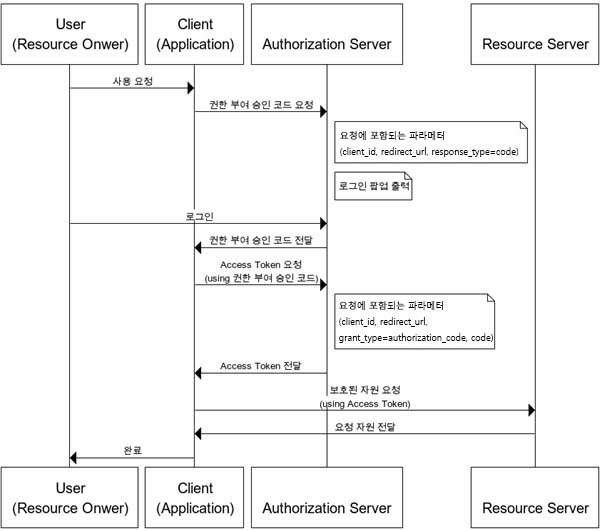
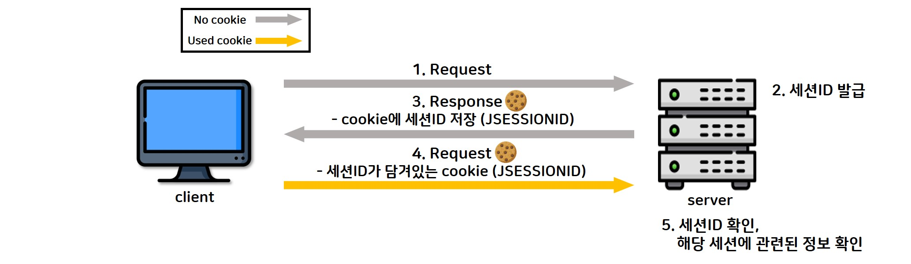

# 10장. OAuth2로 로그인/로그아웃 구현하기
## 10.1 사전지식 : OAuth
### OAuth란?
제3의 서비스에 계정 관리를 맡기는 방식입니다. 
(흔히 볼 수 있는 네이버, 구글, 카카오 등으로 로그인하는 방법)

### OAuth 용어
- 리소스 오너(Resource Owner) 
 자신의 정보를 사용하도록 인증 서버에 허가하는 주체
- 리소스 서버(Resource Server) 
 리소스 오너의 정보를 가지며, 사용자의 보호된 자원을 호스팅하는 서버입니다.
- 인증 서버(Authorization Server) 
 클라이언트에게 리소스 오너의 정보에 접근할 수 있는 토큰을 발급하는 역할을 하는 애플리케이션입니다. 
- 클라이언트(Client) 
 보호된 자원을 사용하려고 접근 요청을 하는 애플리케이션입니다.

### OAuth 권한 부여 방식 4가지
- 권한 부여 코드 승인 타입 (authorization code grant type)
- 암시적 승인 타입 (implicit grant type)
- 리소스 소유자 암호 자격증명 승인 타입(resource owner password credentials)
- 클라이언트 자격증명 승인 타입(client credentials grant)

### 권한 부여 승인 코드 방식(Authorization Code Grant)
권한 부여 승인을 위해 자체 생성한 Authorization Code를 전달하는 방식으로 많이 쓰이고 기본이 되는 방식입니다. 
보통 타사의 클라이언트에게 보호된 자원을 제공하기 위한 인증에 사용됩니다. Refresh Token의 사용이 가능한 방식입니다. 
(구글, 페이스북, 카카오톡 간편 로그인을 사용해봤다면, 익숙한 승인 타입)

## 💥 주의사항 💥
로그인을 위해서 사용된 인증값 클라이언트 ID와 클라이언트 보안 비밀번호는 유출되면 안되는 중요한 정보입니다.
보안을 위해 해당코드가 작성된 application.yml 파일이 깃허브에 올라가지 않도록, .gitignore 파일을 꼭 수정해 주어야 합니다.

## 10.2 쿠키
쿠키란 사용자가 어떠한 웹사이트를 방문했을 때, 웹사이트가 사용하는 서버에서 로컬 환경에 저장하는 작은 데이터를 입니다. 
(웹 애플리케이션에서 사용자의 상태를 유지하고, 세션 관리, 개인화 설정등 다양한 용도로 사용)  
쿠키는 key와 value로 이루어져 있으며 만료기간, 도메인, 경로 등의 정보를 가지고 있습니다.

